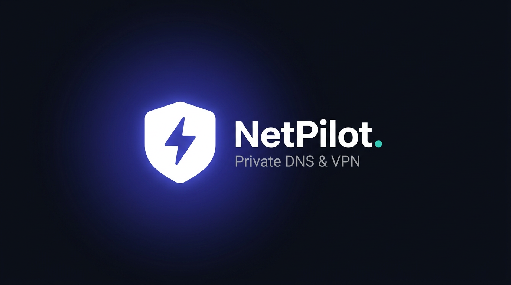

# NetPilot — Private DNS & VPN for Android TV (and every Android screen)

<p align="center"></p>

**NetPilot** puts the missing **Private DNS (DNS-over-TLS)** controls of Android TV — and a clean,
profile-based **VPN** manager — behind one beautiful, remote-control-first interface.
100% first-party code: **no third-party runtime libraries** beyond Google's own AndroidX/Material,
**no analytics, no ads, no telemetry, no network calls of its own.**

Built for **Android TV (D-pad/remote first)**, running everywhere else too — phones and tablets,
Android **9.0+ (API 28)** → **Android 15 (API 35)**, all densities, light & dark themes.

---

## Why NetPilot exists

Most Android TV builds hide the *Private DNS* settings screen — but the feature itself is alive and
well inside the OS since Android 9. NetPilot drives the system settings directly
(`Settings.Global → private_dns_mode / private_dns_specifier`), the same keys the hidden menu writes.

Because Android (correctly) protects these settings, a **one-time permission grant over ADB** is
needed — no root, ~2 minutes, survives reboots and app updates:

```bash
adb shell pm grant app.netpilot android.permission.WRITE_SECURE_SETTINGS
```

The app walks the user through this with a built-in, copy-paste setup guide and verifies the grant
live. Without the grant, everything is still browsable and the VPN works — only system DNS writes
are held back.

## Features

### 🔒 Private DNS — two ways
**Zero-setup Secure DNS (no ADB, no computer):** a first-party DNS-over-TLS tunnel inside
`VpnService` — Android asks for VPN permission once (a normal dialog, remote-friendly) and every
DNS lookup is encrypted to your selected provider. Bootstrap resolution happens before the tunnel
comes up, so the provider can never recurse into the tunnel. Limited to DNS, nothing else is routed.

**System Private DNS (strongest, one-time ADB):** drives the real `Settings.Global` keys —
device-wide, kernel-enforced, also covers apps that ignore per-app DNS. Grant:

```bash
adb shell pm grant app.netpilot android.permission.WRITE_SECURE_SETTINGS
```

No computer? Install Termux on any Android phone → `pkg install android-tools` →
`adb connect <TV_IP>:5555` → run the grant from the phone over Wi-Fi.

**Common to both modes:**
- Multiple **profiles** (name + DoT hostname, e.g. `dns.google`, `one.one.one.one`, `dns.adguard-dns.com`)
- **Single-active invariant**: activating one profile automatically deactivates the previous one —
  exactly one provider is ever live
- Modes: **Off · Automatic (opportunistic) · Profile (strict hostname)**
- Input validation with dedicated errors for "that's an IP, Private DNS needs a hostname"
- Live system-state sync via `ContentObserver` (catches out-of-app changes instantly)

### 🛡 VPN
- **Native platform IKEv2/IPsec** (Android 11+): the OS implements the protocol — NetPilot only
  provisions and starts/stops it via `VpnManager`/`Ikev2VpnProfile` (PSK or username/password + CA cert)
- **OpenVPN** profiles: import `.ovpn` files with a built-in first-party config parser
  (remotes, ciphers, inline CA/cert/key blocks, auth style). The packet-level engine is a pluggable
  seam — see `core.vpn.VpnDataChannel` and [docs/SECURITY.md](docs/SECURITY.md)
- Android keeps one VPN active system-wide; the UI mirrors that honestly

### 🧭 TV-first UX
- Left **navigation rail** on TV (Netflix-style), bottom navigation on phones/tablets
- Every control is D-pad reachable; focus ring + lift + zoom make focus unmistakable at 10 feet
- Big type, ≥48 dp targets, high-contrast palettes for both themes

### Also on board
- **Dashboard**: protection state hero, quick toggles, live network facts (interface, effective DNS)
- **Settings**: theme (system/light/dark), permission status, profile export/import (JSON via SAF),
  privacy statement, in-app open-source licenses
- Advisory (not a blocker) when **VPN + strict Private DNS** run together — they *can* coexist;
  strict DoT then encrypts lookups even inside the tunnel

## Build it yourself

```bash
git clone <this repo> && cd netpilot
./gradlew :app:assembleDebug          # → app/build/outputs/apk/debug/app-debug.apk
./gradlew :app:testDebugUnitTest      # 71 JVM tests (JUnit + Robolectric)
./gradlew :app:lintDebug              # Android Lint gate
```

Or just push — GitHub Actions builds, tests, lints and scans on every commit (see below).

## Install

1. Sideload the APK (Settings → Apps → Install unknown apps on TV, or `adb install app-debug.apk`)
2. Open NetPilot → follow the **one-time setup guide** for the ADB grant
3. Add a DNS profile (e.g. *Cloudflare* / `one.one.one.one`) → activate. Done.

## CI/CD & security

| Workflow | What it does |
|---|---|
| **CI** (`ci.yml`) | Unit tests → Lint → APK build → instrumented tests on real emulators (API 29 & 34, one leg with the ADB permission granted to exercise true system writes) |
| **Security** (`security.yml`) | Gitleaks secret scanning, PR dependency review (vuln + license gate), build-hardening assertions (no cleartext, no debuggable, backups stay excluded) |
| **Release** (`release.yml`) | Tag `v*` → verification gate → signed APK + AAB + SHA-256 checksums + changelog; refuses to publish unsigned |
| **CodeQL** | Static security analysis (Java/Kotlin, security-extended) |

Signing uses repository secrets (`ANDROID_KEYSTORE_B64`, …) — never committed files.
Full details: [docs/RELEASE.md](docs/RELEASE.md), [docs/SECURITY.md](docs/SECURITY.md).

## Documentation

- [docs/ARCHITECTURE.md](docs/ARCHITECTURE.md) — module map, data flow, the 98%-first-party breakdown
- [docs/DESIGN_SYSTEM.md](docs/DESIGN_SYSTEM.md) — palettes, tokens, components, focus/TV rules
- [docs/SECURITY.md](docs/SECURITY.md) — threat model, permissions, data storage, dependency policy
- [docs/TESTING.md](docs/TESTING.md) — the test pyramid and how to run every layer
- [docs/RELEASE.md](docs/RELEASE.md) — signing + publishing runbook
- [docs/TV_NAVIGATION.md](docs/TV_NAVIGATION.md) — D-pad interaction map
- [docs/VERIFYING.md](docs/VERIFYING.md) — how to verify the APK is real, signed and runs

## License & attribution

App code: **MIT** (see [LICENSE](LICENSE)). Runtime dependencies: first-party Android
libraries only (AndroidX, Material Components, Kotlin stdlib — Apache 2.0). Build/test tooling
(Gradle, JUnit, Robolectric, Espresso) is open-source but never ships in the APK; the full list
lives in-app under **Settings → Open-source licenses**.
